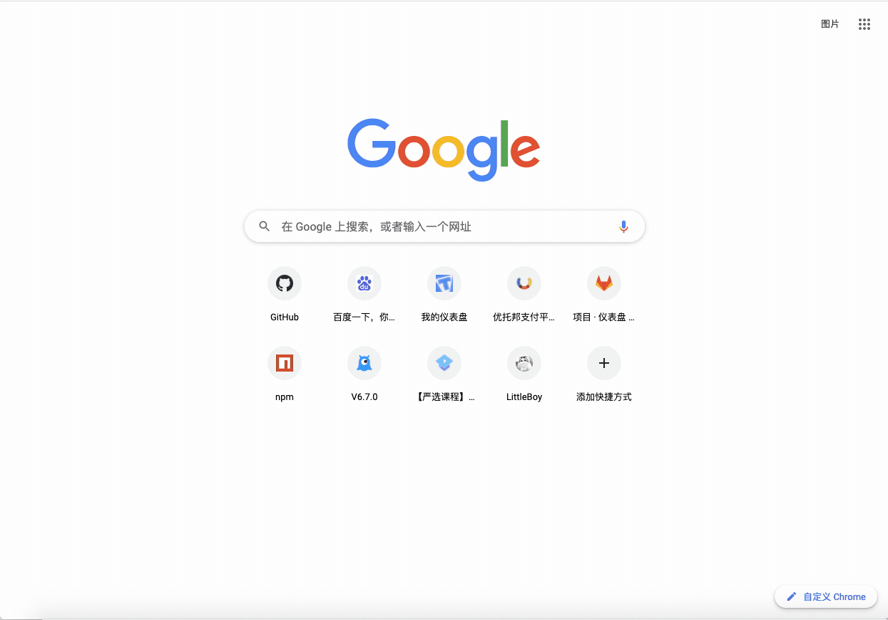

# performance-monitoring

**performance-monitoring 是一个性能监控的 SDK，可以记录 first-paint、first-contentful-paint、first-input-delay、largest-contentful-paint、cumulative-layout-shift、用户的网速等性能指标，可以捕获错误，并且通过配置可以发送错误信息到服务端，可以进行错误的录制，回放错误是怎么产生的，可以对网络请求、长任务进行监听等功能**

**performance-monitoring is a performance monitoring SDK that can record performance indicators such as first-paint, first-contentful-paint, first-input-delay, largest-contentful-paint, cumulative-layout-shift, etc., and can capture errors and configure Error messages can be sent to the server, error recording can be performed, how the playback error is generated, network requests, long tasks can be monitored, etc.**



[在线 Demo](http://performance-monitoring.zhourengui.top/performance-monitoring/demo)

## 使用指南（Guide）

### 安装与使用

#### 通过`<script>`引入

```html
<script src="https://cdn.jsdelivr.net/npm/mini-pm@latest/dist/mini-pm.umd.js"></script>
<script>
  new miniPm({ ...options });
</script>
```

#### 通过`npm`引入

```bash
$ npm install --save mini-pm
```

```javascript
import PerformanceMonitoring from "mini-pm";
new PerformanceMonitoring({ ...options });
```

### 配置介绍

| key                      | 默认值 | 功能                                                                  |
| ------------------------ | ------ | --------------------------------------------------------------------- |
| captureError             | false  | 是否开启错误捕获                                                      |
| fetchDomain              | false  | 发送日志到服务端的域名                                                |
| errEventRoute            | false  | 接收错误录制的路由                                                    |
| errLogRoute              | false  | 接收错误日志的路由                                                    |
| logRoute                 | false  | 接收性能指标的路由                                                    |
| isObserverResourceTiming | false  | 是否监听资源加载的性能                                                |
| isObserverElementTiming  | false  | 是否监听观察元素的性能，需要在 html 标签中添加 elementtiming=".."属性 |
| analyticsTracker         | false  | 对监听的性能指标的回调，包括 资源加载、 观察元素的性能等              |
| recordOptions            | false  | rrweb-record 的配置，详细配置查看 rrweb 的教程文档                    |

### 常用指标详解

1. timeToFirstByte（TTFB）: 浏览器接收到的首个字节的时间

2. firstPaintTime（FP）: 浏览器首次绘制的时间

3. firstContentfulPaint（FCP）: 浏览器首次有内容绘制

4. longTask：超过 50ms 的任务称为长任务

5. bandwidth：用户的网速

### 基本的功能

记录用户的网速、浏览器信息、各种性能指标

```javascript
import PerformanceMonitoring from "mini-pm";
new PerformanceMonitoring({
  fetchDomain: "http://localhost:1234",
  logRoute: "/performance-log",
});
```

当页面加载成功后会发送一个请求`http://localhost:1234/performance-log`到服务端，这个请求不占用主线程，因为用到了浏览器的`window.navigator.sendBeacon`

### 错误的捕获与回溯（Error capture and backtracking）

```javascript
import PerformanceMonitoring from "mini-pm";
new PerformanceMonitoring({
  captureError: true, // 错误捕获的开关
  fetchDomain: "http://localhost:1234", // 发送错误日志的域名
  errEventRoute: "/err-events", // 错误录制请求的路由，一旦发生错误会发送数据到服务端
  errLogRoute: "/err-traceback", // 错误日志收集，可以在这个路由做sourcemap的回溯
});
```

如果使用了录制功能，下面是回放录制的指南

```html
<div id="player"></div>

<link
  rel="stylesheet"
  href="https://cdn.jsdelivr.net/npm/rrweb-player@latest/dist/style.css"
/>
<script src="https://cdn.jsdelivr.net/npm/rrweb-player@latest/dist/index.js"></script>
<script>
  // 这个录制的数据是上面通过/err-events记录的
  fetch("http://localhost:1234/get-err-events")
    .then((req) => req.json())
    .then((res) => {
      document.querySelector("#player").innerHTML = "";
      new rrwebPlayer({
        target: document.querySelector("#player"),
        // 配置项
        props: {
          events: res,
        },
      });
    });
</script>
```

其他关于 rrweb 的使用教程，请到[rrweb 官方教程](https://github.com/rrweb-io/rrweb/blob/master/guide.zh_CN.md)查看对应文档

### 监听资源的加载

```javascript
import PerformanceMonitoring from "mini-pm";
new PerformanceMonitoring({
  isObserverResourceTiming: true,
  analyticsTracker: (options) => {
    console.log(options); // 输出resourceTiming的指标
  }, // 重写回调
});
```

### 监听观察元素的性能

```html
<h2 elementtiming="text" id="text-id">Element-Timing</h2>
<script src="https://cdn.jsdelivr.net/npm/mini-pm@latest/dist/mini-pm.umd.js"></script>
<script>
  new miniPm({
    isObserverElementTiming: true,
    analyticsTracker: (options) => {
      console.log(options); // 输出elementtiming的指标
    }, // 重写回调
  });
</script>
```

## 参考文献（References）

1. [Long Tasks API - Web API 接口参考 | MDN](https://developer.mozilla.org/zh-CN/docs/Web/API/Long_Tasks_API)
2. [Cumulative Layout Shift (CLS)](https://web.dev/cls/)
3. [Measuring Cumulative Layout Shift | Cumulative Layout Shift (CLS), sometimes known as jank, is a measurement of how much elements move due to late-rendered content. You can think of it as a mea... | Request Metrics](https://requestmetrics.com/web-performance/cumulative-layout-shift)
4. [Navigation Timing Level 2](https://w3c.github.io/navigation-timing/)
5. [rrweb.io | Open source web session replay library](https://www.rrweb.io/)
6. [Web Vitals](https://web.dev/vitals/)
7. [Add types for window.performance.getEntriesByType · Issue #33866 · microsoft/TypeScript](https://github.com/microsoft/TypeScript/issues/33866)
8. [StorageEstimate.quota - Web APIs | MDN](https://developer.mozilla.org/en-US/docs/Web/API/StorageEstimate/quota)

## 记录问题（Pit）

1. 为什么要使用这个 SDK？

首先，如果你的网站不在乎用户的体验，那么可以放弃使用这样类似的性能监控的 SDK。

如果你的网站非常在乎用户的体验，包括白屏时间的计算、用户操作的延迟时间、用户是怎么操作出现的错误等都可以使用这个 SDK，一个网站不能通过直觉去感知一个网站的性能。

而且很多前端小伙伴都知道的一个知识点 SPA 白屏时间？，没有一个指标通过理论你凭什么说 SPA 的白屏时间长，这个是需要通过测量的数值去衡量的。

2. 如何屏幕的录制

有多种解决方案：

- 使用 WebRTC，进行实时通信
- 使用 html2canvas 生成一张一张的图片，然后合成为一个视频
- 使用 xpath，然后通过无头浏览器还原 xpath 还原成 png 合成，然后代理掉全部的操作。
- 将 html 全部转化为 vdom，使用 MutationObserver 监听 dom 的变化，记录 dom 的变化，把修改的 dom 还原成真实的 dom，然后鼠标的根据收集到的位置进行 canvas 渲染出来

目前这个项目使用的方案是第四个，一开始的想法也是通过这种方式去实现，在实现的过程中也发现 rrweb 的实现原理也是这样子的，所以就不重复造轮子。

3. 如何不影响业务的情况下去发送请求

解决方案：

使用`window.navigator.sendBeacon`，这个 API 会在浏览器空闲的时候才去发送请求，但是有个缺点就是，没有响应

使用`window.requestIdleCallback`，这个 API 将在浏览器的空闲时段内调用的函数排队。这使开发者能够在主事件循环上执行后台和低优先级工作，而不会影响延迟关键事件，如动画和输入响应。函数一般会按先进先调用的顺序执行，然而，如果回调函数指定了执行超时时间 timeout，则有可能为了在超时前执行函数而打乱执行顺序。

项目中使用 fetch 肯定是会占用并发的，因为 fetch 请求的域名是调用 API 服务器的，但是不会影响到主业务的运行，因为是在浏览器空闲的时候才去发送的请求

但是 Image 不占并发，因为 Image 的域名是 CDN 域名，所以只占 CDN 域名的并发，所以不占业务请求的并发

Image 是怎么把日志带到服务器？

需要在服务器存放个 1kb 的 gif，然后将数据使用 query 带上数据，不管是 apache、nginx 等都会有日志，然后一般通过 python 去洗这个数据

4. 记录用户浏览器信息、用户网速、本地缓存信息的作用何在？

记录这些信息是非常有必要的，举一个简单的例子，我们的页面做了性能优化，把业务代码都离线缓存在了本地，然后突然有一个用户反应会很卡顿，有一些低端设备当本地缓存达到多少的时候就会出现这种情况，这时候我们不可能去让用户去给我们提供用户浏览器的信息、本地缓存的信息，当我们有这些信息之后，就可以再次进行优化。

5. rrweb 的 record 内置了 window.onerror 的监听，而且并没有保留可以配置的接口

解决方案，拉取源码，定制 rrweb，并且 rrweb 也是使用 typescript 编写，所以修改起来并不难

6. 记录本地的缓存信息需要在 https 的协议下才能获取

[StorageEstimate.quota - Web APIs | MDN](https://developer.mozilla.org/en-US/docs/Web/API/StorageEstimate/quota)
